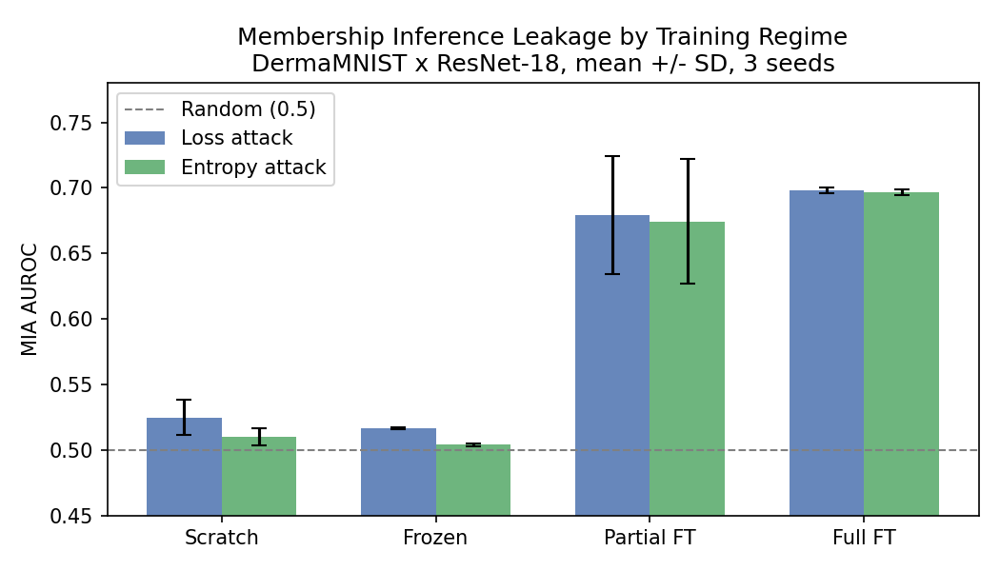
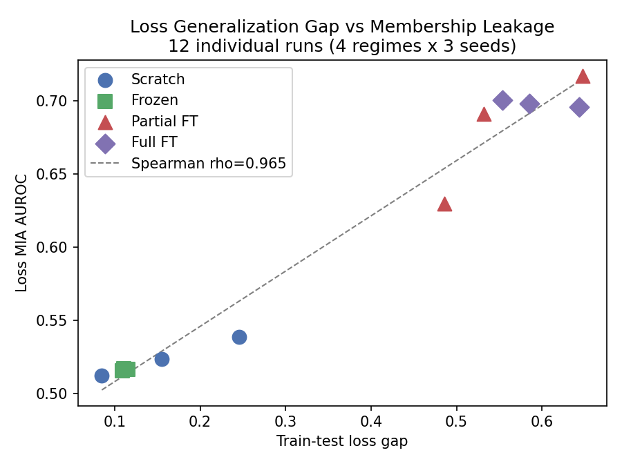

# Membership Privacy Auditing in Transfer-Learned Medical Deep Learning

How much does your fine-tuning strategy affect membership inference risk?
This repo investigates that question empirically using DermaMNIST and
ResNet-18 across four training regimes.

## Background

Transfer learning is commonly used for biomedical image classification when
labeled data is limited. However, fine-tuning a pretrained model on sensitive
medical data raises an important privacy question: does the fine-tuning
strategy affect how much information the model memorizes about individual
training examples?

This project tries to answer that with actual experiments rather than
assumptions.

## What I did

Trained ResNet-18 on DermaMNIST (224x224, MedMNIST+) under four conditions:

- **Scratch** - random init, all parameters trainable
- **Frozen** - ImageNet weights, only the classifier head updated (0.03% of params)
- **Partial FT** - ImageNet weights, layer4 + head unfrozen (75% of params)
- **Full FT** - ImageNet weights, all parameters unfrozen

Each regime was run with 3 random seeds (42, 123, 2026). After training,
I ran three membership inference attacks on every model: loss-based,
confidence-based, and entropy-based. Attack accuracy is evaluated on a
balanced member/non-member subset using balanced accuracy to avoid the
class imbalance issue (7007 members vs 2005 non-members).

## Results

| Regime | Test AUROC | Accuracy Gap | Loss MIA AUC | Entropy TPR @ 1% FPR |
|--------|-----------|---------|--------------|----------------------|
| Frozen | 0.930 +/- 0.000 | 0.046 +/- 0.003 | 0.516 +/- 0.001 | 0.010 +/- 0.001 |
| Scratch | 0.931 +/- 0.004 | 0.062 +/- 0.031 | 0.525 +/- 0.013 | 0.010 +/- 0.001 |
| Partial FT | 0.967 +/- 0.001 | 0.148 +/- 0.002 | 0.679 +/- 0.045 | 0.015 +/- 0.003 |
| Full FT | 0.974 +/- 0.004 | 0.128 +/- 0.003 | 0.698 +/- 0.002 | 0.034 +/- 0.003 |

Mean +/- sample SD across 3 seeds.





Across the four training strategies, stronger adaptation of pretrained
features improved classification performance but was accompanied by greater
vulnerability to the simple membership attacks evaluated here.

Frozen feature extraction remained near chance under the simple membership
attacks evaluated here, with loss-MIA AUROC of 0.516 +/- 0.001. Partial and
full fine-tuning increased loss-MIA AUROC to 0.679 +/- 0.045 and
0.698 +/- 0.002, respectively.

Across the 12 trained models, the train-test loss gap was strongly associated
with loss-based MIA AUROC (Spearman rho=0.965, p=3.88e-07). The accuracy
generalization gap was also strongly associated with leakage (rho=0.860,
p=3.32e-04), although the relationship was weaker. These associations are
exploratory rather than causal because all 12 observations come from repeated
training regimes on a single dataset and architecture.

Partial FT also exhibits the largest accuracy generalization gap of any
regime, consistent with the strong association observed between generalization
gap and membership leakage.

Interestingly, entropy achieves higher TPR at 1% FPR on fully fine-tuned
models than loss or maximum-confidence attacks. For full FT, entropy reached
approximately 3.4% TPR at 1% FPR while loss and confidence attacks produced
0% at the same operating point. This suggests that the full predictive
distribution may contain membership signal not captured by a single confidence
score, motivating further investigation with stronger attacks such as LiRA.

## Limitations

This study currently evaluates one biomedical dataset and one architecture,
so the observed trends should not be assumed to generalize across medical
imaging tasks or model families.

The membership attacks are limited to loss-, confidence-, and entropy-based
methods. Stronger likelihood-ratio attacks such as LiRA remain future work.
The result that frozen probing remained near chance under these three attacks
does not imply the model is generally privacy-safe.

Low-FPR estimates should be interpreted cautiously. DermaMNIST provides 2,005
non-member test examples, giving an empirical FPR resolution of approximately
0.05%. TPR estimates at 0.1% FPR are therefore based on very few allowable
false positives.

The correlation analysis across 12 trained models is exploratory. It reflects
repeated runs from four training regimes on the same dataset and architecture
and should not be interpreted as evidence of a causal relationship between
generalization gap and membership leakage.

## Reproducing

```bash
pip install -r requirements.txt

# train (repeat for each regime and seed)
python scripts/train_target.py --config configs/derma_resnet18.yaml --regime frozen --seed 42

# extract per-sample outputs
python scripts/extract_outputs.py --config configs/derma_resnet18.yaml --regime frozen --seed 42

# attacks, correlation analysis, plots
python scripts/run_simple_attacks.py
python scripts/phase9_analysis.py
python scripts/generate_plots.py
```

Checkpoints are not included in the repo. All per-run configs, metrics,
and attack results are under experiments/.

## What is next

- BloodMNIST and DenseNet-121 to check if the pattern holds across
  datasets and architectures
- LiRA (Carlini et al. 2022) for a stronger attack baseline
- Regularization experiments: label smoothing and dropout as privacy interventions

## Structure

    src/            data loading, models, training utilities
    scripts/        end-to-end pipeline scripts
    configs/        hyperparameter files per dataset and architecture
    experiments/    per-run configs, metrics, and attack results (12 runs)
    results/        aggregated CSVs
    plots/          figures
    tests/          unit tests for model freezing and data loading

## References

Yang, J. et al. MedMNIST v2: A Large-Scale Lightweight Benchmark for 2D
and 3D Biomedical Image Classification. Scientific Data, 2023.

Shokri, R. et al. Membership Inference Attacks Against Machine Learning
Models. IEEE S&P, 2017.

Yeom, S. et al. Privacy Risk in Machine Learning: Analyzing the Connection
to Overfitting. CSF, 2018.

Carlini, N. et al. Membership Inference Attacks From First Principles.
IEEE S&P, 2022.
